# Rich Bizness Universe — Supabase Master Map

This is the canonical backend/data map for `Rich-Bizness-Universe-`.

It maps the live Supabase project into the GitHub monorepo and prevents pages, APIs, games, uploads, engines, and database objects from becoming disconnected or duplicated.

## Project identity

| Item | Value |
|---|---|
| Supabase project | `Rich-Bizness-mobile` |
| Project reference | `xfsrqomsiulswbalgknx` |
| API URL | `https://xfsrqomsiulswbalgknx.supabase.co` |
| Region | `us-west-2` |
| PostgreSQL | `17.6.1.121` |
| GitHub repository | `Thatboytaythou/Rich-Bizness-Universe-` |
| Web runtime | `apps/web` |
| Server runtime | `apps/api` |
| Database source | `supabase/` |
| Full introspection query | `supabase/schema-map.sql` |

## Whole-system map

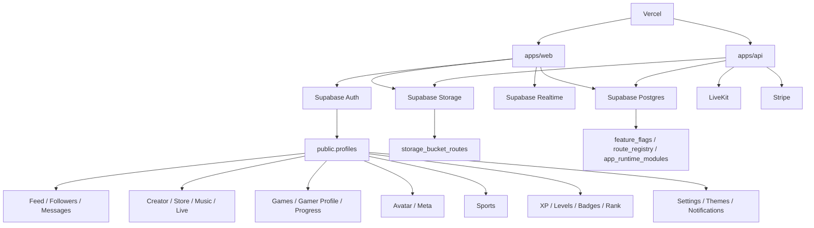

## Ownership rule

- Supabase owns Auth, relational data, RLS, realtime publication membership, storage metadata, RPC functions, triggers, migrations, and Edge Functions.
- GitHub owns browser code, server code, engines, game implementations, validation, generated database types, schema-map tooling, and tests.
- Vercel builds and serves GitHub code and server functions.
- LiveKit handles realtime audio/video rooms; Supabase stores room, participant, event, purchase, and recording state.
- Stripe handles payments; Supabase stores products, orders, creator balances, purchases, tips, unlocks, and sync events.
- A table existing does not mean the visible feature or runtime is complete.

# 1. Identity, authentication, profile, account state

## Core relationship

```text
auth.users.id
  └── public.profiles.id
       ├── public.public_profile_cards.user_id
       ├── public.user_settings.user_id
       ├── public.profile_theme_settings.user_id
       ├── public.user_sessions.user_id
       ├── public.user_levels.user_id
       ├── public.meta_avatars.user_id
       ├── public.gamer_profiles.user_id
       ├── public.sports_profiles.user_id
       ├── public.store_seller_profiles.user_id
       └── every creator/content/member/owner foreign key
```

### Public identity tables

- `profiles` — canonical private/account profile and cross-section identity.
- `public_profile_cards` — safe synchronized public projection.
- `followers` — follower/following graph.
- `user_settings` — user-owned app settings.
- `profile_theme_settings` — profile visual theme.
- `section_theme_settings` — section-level themes and motion.
- `user_sessions` — application session continuity.
- `trust_events` — account trust history.
- `rb_personality_settings` — Rich Bizness personality layer.
- `user_custom_screens` — user-specific screen/layout configuration.
- `layout_presets` — reusable layout presets.
- `background_presets` — reusable backgrounds.

### Auth schema

- `auth.users`
- `auth.identities`
- `auth.sessions`
- `auth.refresh_tokens`
- `auth.audit_log_entries`
- `auth.instances`
- `auth.flow_state`
- `auth.one_time_tokens`
- `auth.mfa_factors`
- `auth.mfa_challenges`
- `auth.mfa_amr_claims`
- `auth.sso_providers`
- `auth.sso_domains`
- `auth.saml_providers`
- `auth.saml_relay_states`
- `auth.oauth_clients`
- `auth.oauth_authorizations`
- `auth.oauth_consents`
- `auth.oauth_client_states`
- `auth.custom_oauth_providers`
- `auth.webauthn_credentials`
- `auth.webauthn_challenges`
- `auth.schema_migrations`

### GitHub owners

```text
apps/web/src/core/auth/
apps/web/src/core/identity/
apps/web/src/stores/auth.store.ts
apps/web/src/stores/profile.store.ts
apps/api/auth/
apps/api/profile/
packages/auth/
packages/profile/
```

# 2. Feed, gallery, following, comments, uploads

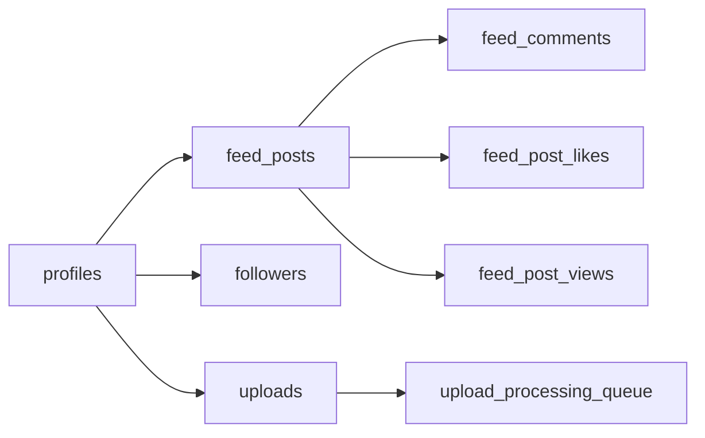

Tables:

- `feed_posts`
- `feed_comments`
- `feed_post_likes`
- `feed_post_views`
- `followers`
- `uploads`
- `upload_processing_queue`
- `brand_assets`
- view `active_brand_assets`

Gallery uses `feed_posts` with section/type ownership instead of creating a duplicate social-post source of truth.

GitHub owners:

```text
apps/web/src/pages/feed/
apps/web/src/pages/gallery/
apps/web/src/features/upload/
apps/web/src/core/storage/
apps/api/uploads/
packages/media/
supabase/functions/upload-processor/
```

# 3. Direct messages, attachments, reactions, calls

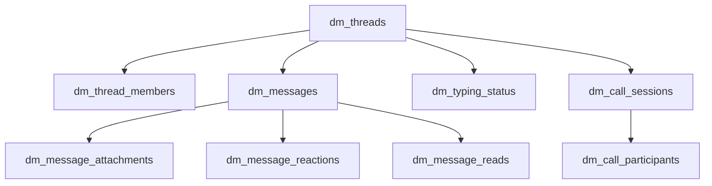

Tables:

- `dm_threads`
- `dm_thread_members`
- `dm_messages`
- `dm_message_attachments`
- `dm_message_reactions`
- `dm_message_reads`
- `dm_typing_status`
- `dm_call_sessions`
- `dm_call_participants`

GitHub owners:

```text
apps/web/src/features/messages/
apps/web/messages.html
apps/api/livekit/
engines/live/
```

# 4. Notifications, alerts, push devices

Tables:

- `rich_notifications`
- `notification_groups`
- `notification_reads`
- `push_devices`
- `creator_alert_subscriptions`
- `live_alert_subscriptions`
- `sports_alert_subscriptions`
- `game_alert_subscriptions`
- `store_notifications`

GitHub owners:

```text
apps/web/src/features/notifications/
apps/web/src/stores/notification.store.ts
apps/api/notifications/
supabase/functions/notification-dispatcher/
```

# 5. Music, podcast, radio, playlists, listening history

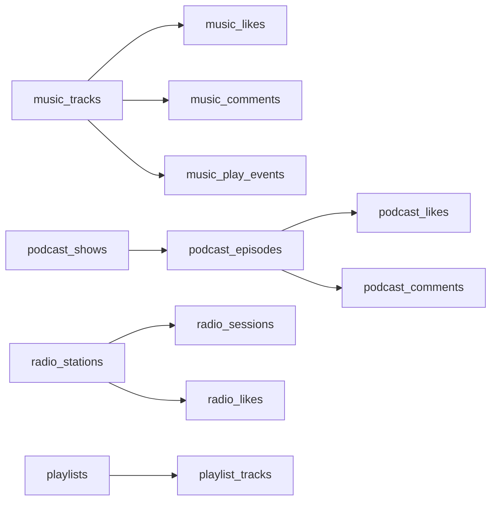

Tables:

- `music_tracks`
- `tracks` — legacy compatibility source still present.
- `music_likes`
- `music_comments`
- `music_play_events`
- `playlists`
- `playlist_tracks`
- `podcast_shows`
- `podcast_episodes`
- `podcast_likes`
- `podcast_comments`
- `radio_stations`
- `radio_sessions`
- `radio_likes`
- `audio_listening_history`

GitHub owners:

```text
apps/web/src/pages/music/
apps/web/src/components/player/
apps/web/src/stores/player.store.ts
engines/media/audio-player/
engines/media/waveform/
engines/media/visualizer/
```

# 6. Live streaming, watching, chat, tips, purchases

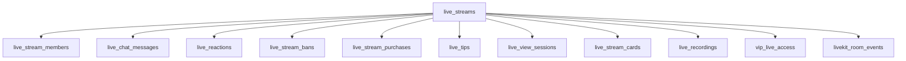

Tables:

- `live_streams`
- `live_stream_members`
- `live_chat_messages`
- `live_reactions`
- `live_stream_bans`
- `live_stream_purchases`
- `live_tips`
- `live_view_sessions`
- `live_stream_cards`
- `live_recordings`
- `vip_live_access`
- `livekit_room_events`

Edge Function:

- `livekit-token` — active, version 3, JWT verification enabled.

GitHub owners:

```text
apps/web/src/pages/live/
apps/web/src/pages/watch/
apps/web/src/core/livekit/
apps/api/livekit/
engines/live/
supabase/functions/livekit-webhook/
```

# 7. Store, seller, cart, orders, creator economy

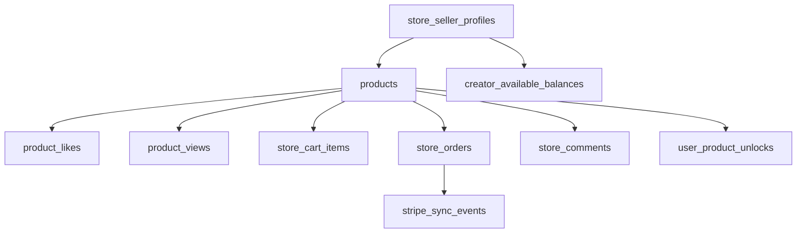

Tables:

- `store_seller_profiles`
- `products`
- view `creator_products` — compatibility view; `products` is source of truth.
- `product_likes`
- `product_views`
- `store_cart_items`
- `store_orders`
- `store_comments`
- `store_notifications`
- `user_product_unlocks`
- `creator_available_balances`
- `stripe_sync_events`

GitHub owners:

```text
apps/web/src/pages/store/
apps/web/src/features/seller-hub/
apps/web/src/features/wallet/
apps/web/src/core/payments/
apps/api/stripe/
packages/payments/
supabase/functions/stripe-webhook/
```

# 8. Creator system

Tables:

- `creator_page_settings`
- `creator_alert_subscriptions`
- `creator_available_balances`
- `brand_assets`
- `products`
- `music_tracks`
- `live_streams`
- `games`
- `meta_worlds`

`creator_page_settings` links a creator identity to featured Music, Store, Live, Game, and Meta content.

GitHub owners:

```text
apps/web/src/pages/creator/
apps/web/src/features/creator-hub/
apps/api/profile/
packages/profile/
```

# 9. Sports

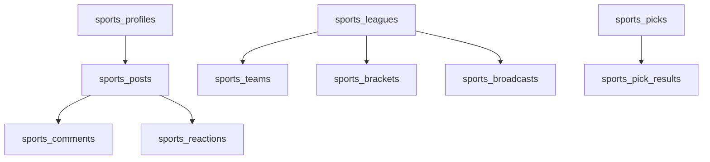

Tables:

- `sports_profiles`
- `sports_leagues`
- `sports_teams`
- `sports_posts`
- `sports_uploads`
- `sports_picks`
- `sports_pick_results`
- `sports_brackets`
- `sports_broadcasts`
- `sports_comments`
- `sports_reactions`
- `sports_alert_subscriptions`

GitHub owners:

```text
apps/web/src/pages/sports/
apps/web/src/features/sports-profile/
apps/api/uploads/
```

# 10. Games — 24 separate products plus shared backend services

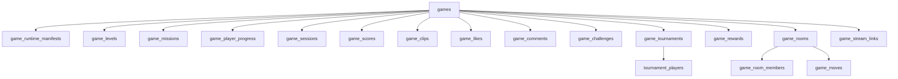

Tables:

- `game_categories`
- `games`
- `gamer_profiles`
- `gaming_uploads`
- `game_runtime_manifests`
- `game_levels`
- `game_missions`
- `game_player_progress`
- `game_sessions`
- `game_scores`
- `game_clips`
- `game_likes`
- `game_comments`
- `game_challenges`
- `game_tournaments`
- `tournament_players`
- `game_rewards`
- `game_stream_links`
- `game_platform_accounts`
- `game_rooms`
- `game_room_members`
- `game_moves`
- `game_alert_subscriptions`

Individual GitHub owners:

```text
games/avatar-free-roam/
games/bizness-party-room/
games/boss-walk-battle/
games/cash-rain-catcher/
games/diamond-bat-flip/
games/dj-radio-run/
games/empire-builder/
games/golf-green-gold/
games/gym-grind-reps/
games/hero-villain-showdown/
games/market-flip/
games/money-road-runner/
games/portal-dash/
games/portal-room-rush/
games/rich-chess/
games/rich-court-king/
games/rich-runner/
games/smoke-burst-arena/
games/smoke-city-hustle/
games/smoke-room-cards/
games/smoke-tap/
games/studio-showdown/
games/treehouse-ride/
games/vault-unlock/
```

Shared owners:

```text
engines/game-runtime/
apps/api/games/
games/registry.ts
games/catalog.ts
games/runtime-loader.ts
```

The 24 catalog rows are separate games. Runtime status and `is_playable` must remain truthful per game; a manifest or database row alone is not a finished game.

# 11. Avatar engine and loadouts

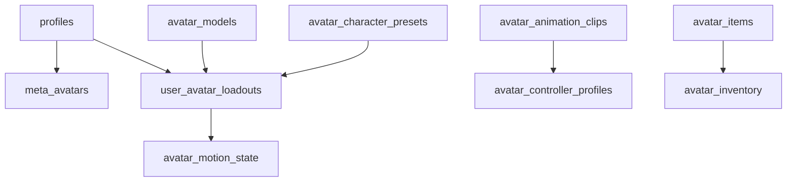

Tables:

- `avatar_models`
- `avatar_animation_clips`
- `avatar_controller_profiles`
- `user_avatar_loadouts`
- `avatar_motion_state`
- `avatar_character_presets`
- `avatar_items`
- `avatar_inventory`
- `meta_avatars`

GitHub owners:

```text
apps/web/src/features/avatar-lab/
apps/web/src/stores/avatar.store.ts
apps/api/avatar/
engines/avatar/
supabase/functions/avatar-asset-validator/
apps/web/public/models/
apps/web/public/animations/
```

Database manifests do not replace GLB/GLTF/VRM/FBX models, textures, rigs, or animation files.

# 12. Meta worlds, rooms, portals, inventory

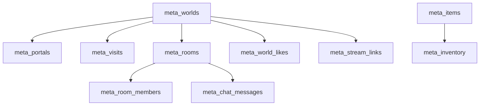

Tables:

- `meta_avatars`
- `meta_worlds`
- `meta_portals`
- `meta_visits`
- `meta_rooms`
- `meta_room_members`
- `meta_chat_messages`
- `meta_world_likes`
- `meta_stream_links`
- `meta_items`
- `meta_inventory`

GitHub owners:

```text
apps/web/src/pages/meta/
engines/meta/
engines/avatar/
apps/web/public/models/environments/
apps/web/public/models/portals/
```

# 13. XP, ranks, badges, progression

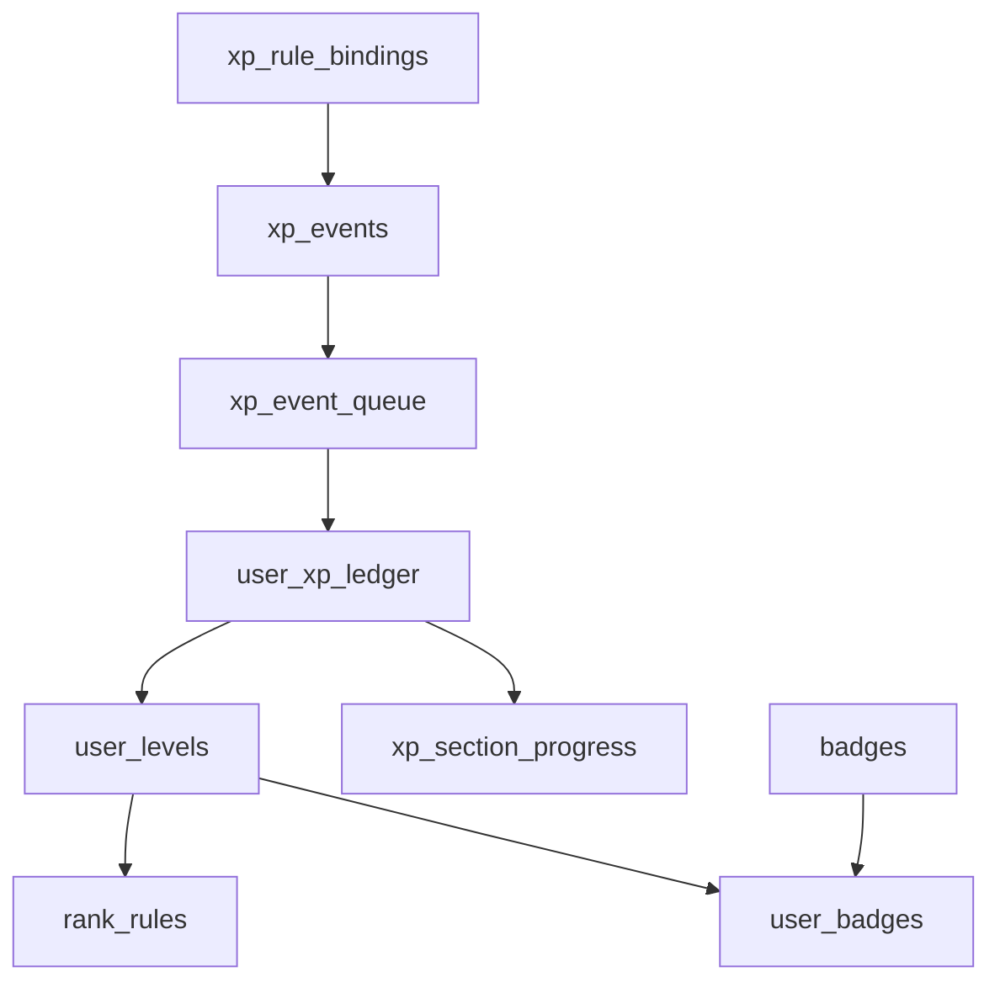

Tables:

- `xp_events`
- `xp_event_queue`
- `user_xp_ledger`
- `xp_rule_bindings`
- `xp_section_progress`
- `user_levels`
- `rank_rules`
- `badges`
- `user_badges`

GitHub owners:

```text
apps/web/src/core/xp/
apps/web/src/stores/xp.store.ts
apps/api/xp/
packages/xp/
supabase/functions/xp-processor/
```

XP awarding must remain server/RPC/Edge-Function controlled. Browser code displays and requests events; it does not directly grant trusted balances or rewards.

# 14. Search and discovery

Tables:

- `search_queries`
- `search_clicks`
- searchable domain tables: profiles, feed, music, podcasts, radio, live, sports, products, games, Meta.

GitHub owners:

```text
apps/web/src/features/search/
apps/web/src/core/search/
```

# 15. Admin, moderation, operations, analytics

Tables:

- `admin_roles`
- `admin_audit_logs`
- `moderation_reports`
- `content_review_queue`
- `api_jobs`
- `api_request_logs`
- `api_webhook_events`
- `platform_analytics_events`
- `platform_announcements`
- `system_health_checks`
- `feature_flags`

GitHub owners:

```text
apps/web/src/pages/admin/
apps/web/src/features/admin-command/
apps/web/src/core/moderation/
apps/web/src/core/analytics/
apps/api/moderation/
apps/api/webhooks/
infrastructure/monitoring/
infrastructure/feature-flags/
```

# 16. Routes, capabilities, environment, runtime registry

Tables:

- `route_registry`
- `route_access_rules`
- `app_runtime_modules`
- `app_env_contract`
- `feature_flags`
- `storage_bucket_routes`
- `rb_secret_rooms`

GitHub owners:

```text
packages/config/src/routes.ts
packages/config/src/env.ts
packages/config/src/buckets.ts
apps/web/src/config/
apps/web/src/router.ts
apps/web/src/route-loader.ts
infrastructure/vercel/environment.contract.ts
```

Public runtime environment contract:

```text
NEXT_PUBLIC_SUPABASE_URL
NEXT_PUBLIC_SUPABASE_ANON_KEY
LIVEKIT_URL
APP_URL
APP_NAME
APP_ENVIRONMENT
```

Server-only secrets must never be written into browser code or `VITE_`/`NEXT_PUBLIC_` variables.

# 17. Storage map

Supabase Storage system tables:

- `storage.buckets`
- `storage.objects`
- `storage.s3_multipart_uploads`
- `storage.s3_multipart_uploads_parts`
- `storage.buckets_analytics`
- `storage.buckets_vectors`
- `storage.vector_indexes`
- `storage.migrations`

Application routing table:

- `public.storage_bucket_routes`

Known application bucket families:

```text
avatars
profile-banners
general-uploads
gallery-media
live-recordings
live-thumbnails
music-audio
music-covers
podcast-audio
podcast-covers
radio-covers
sports-media
sports-clips
sports-covers
game-assets
game-clips
game-covers
store-products
store-digital
store-seller-media
meta-avatars
```

Legacy aliases and duplicate bucket names must be audited before any deletion or move. Storage database records do not prove the corresponding visual/model/audio asset exists.

# 18. Realtime map

System relations:

- `realtime.messages` — partitioned table.
- daily `realtime.messages_YYYY_MM_DD` partitions.
- `realtime.subscription`
- `realtime.schema_migrations`

Application realtime should be registered centrally through:

```text
apps/web/src/core/realtime/realtime-manager.ts
apps/web/src/core/realtime/channel-registry.ts
apps/web/src/core/supabase/channels.ts
apps/web/src/core/supabase/realtime.ts
```

High-value realtime domains:

- Auth/session profile continuity.
- Feed posts, comments, likes.
- Messages, reads, reactions, typing, calls.
- Live streams, members, chat, reactions, room events.
- Games, rooms, members, moves, sessions, scores.
- Meta rooms, members, chat, visits.
- Notifications and XP progression.

# 19. Complete public-schema inventory

This is the current complete public object inventory grouped alphabetically, including the two public views.

```text
admin_audit_logs
admin_roles
active_brand_assets [view]
api_jobs
api_request_logs
api_webhook_events
app_env_contract
app_runtime_modules
audio_listening_history
avatar_animation_clips
avatar_character_presets
avatar_controller_profiles
avatar_inventory
avatar_items
avatar_models
avatar_motion_state
background_presets
badges
brand_assets
content_review_queue
creator_alert_subscriptions
creator_available_balances
creator_page_settings
creator_products [view]
dm_call_participants
dm_call_sessions
dm_message_attachments
dm_message_reactions
dm_message_reads
dm_messages
dm_thread_members
dm_threads
dm_typing_status
feature_flags
feed_comments
feed_post_likes
feed_post_views
feed_posts
followers
game_alert_subscriptions
game_categories
game_challenges
game_clips
game_comments
game_levels
game_likes
game_missions
game_moves
game_platform_accounts
game_player_progress
game_rewards
game_room_members
game_rooms
game_runtime_manifests
game_scores
game_sessions
game_stream_links
game_tournaments
gamer_profiles
games
gaming_uploads
layout_presets
live_alert_subscriptions
live_chat_messages
live_reactions
live_recordings
live_stream_bans
live_stream_cards
live_stream_members
live_stream_purchases
live_streams
live_tips
live_view_sessions
livekit_room_events
meta_avatars
meta_chat_messages
meta_inventory
meta_items
meta_portals
meta_room_members
meta_rooms
meta_stream_links
meta_visits
meta_world_likes
meta_worlds
moderation_reports
music_comments
music_likes
music_play_events
music_tracks
notification_groups
notification_reads
platform_analytics_events
platform_announcements
playlist_tracks
playlists
podcast_comments
podcast_episodes
podcast_likes
podcast_shows
product_likes
product_views
products
profile_theme_settings
profiles
public_profile_cards
push_devices
radio_likes
radio_sessions
radio_stations
rank_rules
rb_personality_settings
rb_secret_rooms
rich_notifications
route_access_rules
route_registry
search_clicks
search_queries
section_theme_settings
sports_alert_subscriptions
sports_brackets
sports_broadcasts
sports_comments
sports_leagues
sports_pick_results
sports_picks
sports_posts
sports_profiles
sports_reactions
sports_teams
sports_uploads
storage_bucket_routes
store_cart_items
store_comments
store_notifications
store_orders
store_seller_profiles
stripe_sync_events
system_health_checks
tournament_players
tracks
trust_events
upload_processing_queue
uploads
user_avatar_loadouts
user_badges
user_custom_screens
user_levels
user_product_unlocks
user_sessions
user_settings
user_xp_ledger
vip_live_access
xp_event_queue
xp_events
xp_rule_bindings
xp_section_progress
```

# 20. Migration history and current edge deployment

The production database currently contains migrations from June 24, 2026 through July 13, 2026. The latest migrations are:

```text
20260713172001 final_rpc_exposure_hardening
20260713172045 final_performance_policy_index_cleanup
20260713201603 align_env_contract_with_vercel
20260713210804 register_avatar_free_roam_runtime_foundation
20260713212309 upgrade_avatar_free_roam_runtime_contract
20260713212631 upgrade_avatar_free_roam_runtime_alpha
```

Major migration families already present:

- Auth/profile trigger repair and onboarding.
- Realtime publication and storage routing.
- Upload compatibility and processing.
- DM/messages and calls.
- Store/economy and Stripe synchronization.
- Music/podcast/radio listening.
- Live/LiveKit room tracking.
- Sports, Meta, Games, XP, Avatar runtime schemas.
- RLS ownership, sensitive reads/writes, function search paths, indexes, and FK coverage.
- Runtime registry, route access, environment contract, and release guards.

Current deployed Edge Functions:

```text
livekit-token  version=3  status=ACTIVE  verify_jwt=true
```

# 21. Truth/status snapshot

Current database records establish these facts:

- `games` contains 24 catalog entries.
- Game runtime manifests exist, but each game must independently earn playable status.
- Profiles, Live, Meta, game sessions/rooms/moves, XP ledger, routes, environment contracts, presets, and feature flags have seeded/operational records.
- Most creator content, store inventory, social posts, messages, sports content, and media catalogs remain sparse or empty until users/admins create content.
- Avatar schema exists, but real models, animation clips, controllers, loadouts, and motion runtime data require matching GitHub/storage assets.
- Storage currently contains only a small number of uploaded objects and no proven full 3D model/rig library.
- Every public table is expected to remain RLS protected.
- `active_brand_assets` and `creator_products` are views and must not be treated as independent write tables.

# 22. GitHub files generated from this map

```text
supabase/schema-map.sql
  Full read-only introspection of relations, columns, constraints, indexes,
  policies, triggers, routines, enums, publications, buckets, and migrations.

docs/architecture/supabase-master-map.md
  Human-readable source-of-truth map tying Supabase to GitHub owners.

supabase/types/database.types.ts
packages/database/src/database.types.ts
apps/web/src/core/supabase/database.types.ts
  Generated database types should be synchronized from production schema.
```

# 23. Required synchronization checks

A release is blocked when any of these drift:

1. GitHub route registry vs `public.route_registry`.
2. GitHub table constants vs the live public schema.
3. GitHub bucket constants vs `storage.buckets` and `storage_bucket_routes`.
4. Generated TypeScript database types vs production schema.
5. Game folders/manifests vs `games` and `game_runtime_manifests`.
6. Avatar asset manifests vs models, clips, controllers, and storage objects.
7. Public Vercel environment names vs `app_env_contract`.
8. Realtime subscriptions vs publication membership and RLS.
9. API/Edge Function contracts vs webhook/event tables.
10. UI completion labels vs actual data, assets, and runtime status.

The canonical machine-readable query is `supabase/schema-map.sql`; this document is the architecture index that explains how every domain belongs together.
